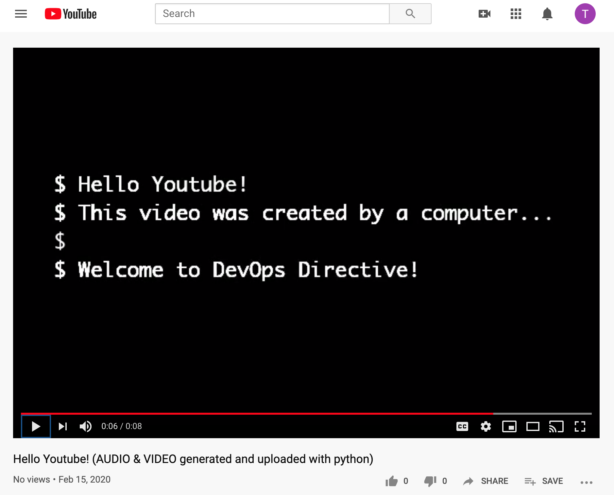

## DevOps Directive Hello World Video

- Video can be see at: `<INSERT LINK>`
- Making of the video can be see at: `<INSERT LINK>`

---

Setup Instructions: 
0. Create and activate python 3.7 virtual environment (`python3 -m venv /path/to/new/venv && source path/to/new/venv/bin/activate`)
1. Install dependencies (`pip install -r requirements.txt`)
2. Enable Youtube Data API and create client secrets in [Google Cloud Console](https://console.developers.google.com/apis/api/youtube.googleapis.com/credentials)
3. Run `create_and_upload_video.py` (uses oauth2 to authorize to YouTube account)

---

This is the first of many pieces of content from DevOps Directive... stay tuned! 
- Youtube (https://www.youtube.com/channel/UC4MdpjzjPuop_qWNAvR23JA)
- Website (https://devopsdirective.com)